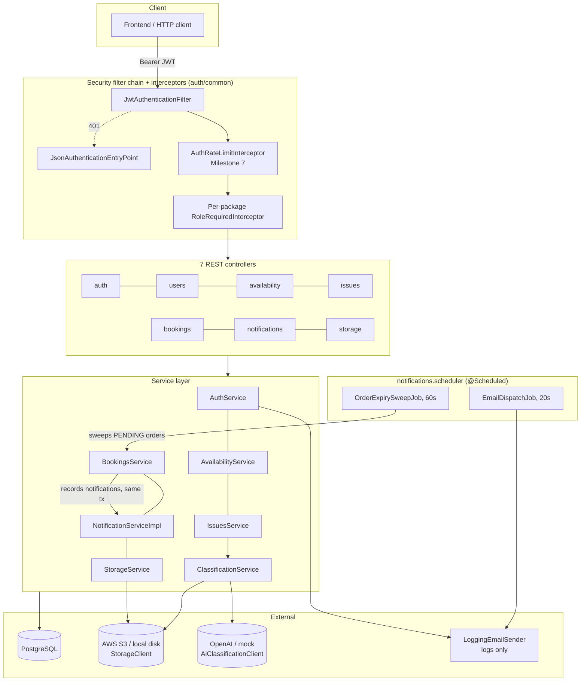

# Pronto — System Overview & Architecture

Status: **Milestones 1-7 (Auth through Hardening & QA) and the follow-on Milestone 8
(Professional Profiles, Reviews, Favorites & Matching) are all implemented on the backend
and QA-signed-off, as of 2026-08-15** (see `docs/architecture/implementation-plan.md` for
milestone-by-milestone status — this line was stale for several milestones and is corrected
here as part of Milestone 8's documentation pass). On the frontend, **Frontend Milestone 1
(auth screens) is implemented, as of 2026-08-15; Frontend Milestone 3 (Standard booking
flow) is implemented, as of 2026-08-16; Frontend Milestone 4 (SOS booking flow UI) is
implemented and QA-signed-off, as of 2026-08-17; Frontend Milestone 5 (in-app
notification bell) is implemented and QA-signed-off, as of 2026-08-18; Frontend
Milestone 6 (professional job-status progression actions — "mark on the way" / "mark
completed") is implemented and QA-passed, as of 2026-08-18; Frontend Milestone 8
(Professional Profiles, Reviews & Favorites) is implemented and functional/data
QA-passed, as of 2026-08-18; and Frontend Milestone 9 (gap-fixes: availability-slot
edit/delete, account deletion, and a professional seeing issue photos before accepting) is
**mixed status, not uniformly done, as of 2026-08-18** — the first two of those three are
fully implemented and fully QA-verified live; the third was code-complete and correctly
implemented but was, at the time Frontend Milestone 9 closed, non-functional in a real
browser due to a pre-existing, cross-cutting image-loading bug outside that round's scope
(see §6 below for the full breakdown). **That blocking bug is now fixed, separately, by
backend MS9 (presigned image URLs, 2026-08-18)** — retrieval no longer requires a JWT a
plain `` tag can't attach, so the third item's frontend code (already correct) now
actually renders images end-to-end; backend MS9 also fixed two further, previously-open
bugs found along the way (stale persisted issue-image URLs; a professional with a
confirmed order never being authorized to view that issue's photos at all) and a related
booking-draft photo-staleness gap. **The Professional Weekly Availability Calendar feature
(backend M1-M2, frontend M3-M6) is also fully implemented and QA-signed-off, zero known open
bugs, including a post-QA bug-fix round (also re-verified and signed off), as of 2026-08-18**
— replaces the professional-facing discrete-slot-creation model with a weekly recurring
working-hours schedule plus manual exception blocks, from which "actual available time" is
derived on demand; also reworks Standard order creation to a direct customer-chosen start
time with a server-derived, fixed 60-minute default job duration, and adds a
`customerPhone` field visible to the assigned professional. See §6 below (its own dedicated
entry) and `docs/architecture/professional-weekly-calendar-design.md` for the full design/
decision record. See §6 below (both the Frontend Milestone 9 and backend
MS9 entries) and `implementation-plan.md`'s Milestone 1 / Milestone 3 / Milestone 4 /
Milestone 5 / Milestone 6 / Frontend Milestone 8 / Frontend Milestone 9 / Backend Milestone
9 / Professional Weekly Availability Calendar entries for full status detail; the rest of
`frontend/` remains design-only or backend-only, pending later frontend milestones. This is
the living source of truth for architecture/decisions — keep it in sync with the actual
implementation as it lands (owned going forward by the `pronto-documentation` agent).

## 1. Consolidated understanding

Pronto is a desktop-first, Hebrew-language web platform (responsive, but not designed
mobile-first) that connects customers who have a home-service problem (plumbing,
electrical, AC, etc.) with independent service professionals. The core pain points it
addresses: customers don't know how to correctly classify their own problem and waste
time/money on the wrong tradesperson or an unresponsive search process; small
professionals struggle to get consistent, qualified leads without expensive advertising.

The end-to-end flow: a customer describes an issue (text + optional photos) → AI
suggests a category, which the customer confirms or edits → the customer books either
**Standard** (browse a list of relevant professionals, each showing their own price
offer, and pick one directly) or **SOS** (browse only professionals currently available
for urgent work, pick one) → the chosen professional accepts or rejects → on acceptance,
both paths converge into the same confirmation/tracking flow with real-time status
updates → the professional updates job status through to completion.

Two user types: **Customer** and **Service Professional** (all professional accounts are
auto-approved in v1.0 — no manual admin review gate). Booking statuses: Pending,
Confirmed, On the Way, Completed, Cancelled, Rejected, Expired — **7 statuses**. Updated
2026-08-12: this overrides the earlier settled 6-status list (which had no `Rejected`) per
direct user instruction — `Rejected` is a distinct status from `Cancelled` so a
professional's explicit decline of a still-`Pending` request is distinguishable from a
cancellation. See `docs/architecture/data-model.md` §2.9 and §3 item 10 for the full
status-transition semantics (including exactly which actor/stage produces `Cancelled` vs.
`Rejected` vs. `Expired`).

## 2. Resolved decisions (settled — do not re-litigate without a new contradiction)

| Topic | Decision | Basis |
|---|---|---|
| Frontend | React | Poster (source of truth) |
| Backend | Java + Spring Boot | Poster |
| Database | **PostgreSQL** | Poster overrides PRD's DynamoDB. PRD's §6 schema is relational (FKs) and maps directly onto Postgres. |
| Cloud | AWS, backend deployed via a managed container service (ECS or Elastic Beanstalk) rather than raw EC2 | User decision — trades a bit of AWS-concept overhead for less manual server management/easier scaling. S3 for images retained; API Gateway/SQS/Lambda from the PRD not yet confirmed as needed. |
| AI | OpenAI | Poster; PRD only said "AI for issue classification" without naming a provider. |
| Payment processing | **Out of scope for v1.0.** `Orders.final_price` is tracked/displayed only, no gateway integration. | Explicit user decision (confirmed twice), overriding the older presentation's loose mention of "payment" in the end-to-end flow. Matches PRD §10.5 out-of-scope list. |
| GPS / live location tracking | **Out of scope for v1.0 — hard exclusion**, not a "future version" maybe. | Explicit user decision (confirmed twice), matches PRD §10.3. Real-time *status* notifications (see §3.3) are in scope; a live map/GPS feed is not. |
| Interface language | Hebrew only for v1.0 | PRD §3.1.3 |
| Platform | Desktop-first responsive web (not mobile-first); no native iOS/Android, no offline mode | User decision, overriding PRD §4.1's mobile-first framing — the app should be designed primarily for desktop/laptop use, while remaining usable on mobile browsers. |
| Real-time transport | **Short-polling** (client polls every 3–5s), not WebSocket | User decision — simpler to implement than STOMP/WebSocket; PRD's ~1s target is still reachable with short polling intervals. |
| Notification channels | In-app (via polling) + email | User decision. Email also used for verification codes. SMS/push not requested by any source document. |
| Professional approval | **Auto-approved in v1.0** — no manual admin review gate | User decision, overriding PRD's admin-approval requirement. Simplifies `professionals` package: no approval workflow/admin screen needed for v1.0. |
| Chat between users | Out of scope for v1.0 | PRD §10.4 |
| Additional languages | Out of scope for v1.0 | PRD §10.6 |
| Booking statuses | 7 values: Pending, Confirmed, On the Way, Completed, Cancelled, Rejected, Expired (`Rejected` added as a 7th status) | User decision (2026-08-12), overriding the originally-settled 6-status list (PRD §3.6.1 has no "Rejected"). See `data-model.md` §2.9/§3 item 10 for the precise Rejected-vs-Cancelled-vs-Expired transition rules. |
| Business timezone (for recurring weekly scheduling) | **`Asia/Jerusalem`** — a single fixed, named constant (`AvailabilityDerivationService.BUSINESS_TIMEZONE`), not a per-professional/per-region setting. | User decision (2026-08-18), Professional Weekly Availability Calendar feature. Before this feature, no part of the codebase needed to reason about *wall-clock recurring* time — every prior `TIMESTAMPTZ` column is a point-in-time value, not a weekly rule — so no such constant existed anywhere; `data-model.md` §0 only noted "infra likely runs UTC." Now the single source of truth for interpreting `professional_working_hours`'s `TIME` columns, the calendar-derivation algorithm, and the order-creation duration/validation logic. See `docs/architecture/professional-weekly-calendar-design.md` §9.5 and `docs/architecture/api-contract-availability.md` §0. |
| Default Standard-booking job duration | **60 minutes, fixed** — the customer picks only a start time; the system derives `bookedEnd = bookedStart + 60 min` server-side (`bookings.service.BookingsService.DEFAULT_JOB_DURATION_MINUTES`). Not category-specific, not professional-configurable. | **Genuine product decision made without direct source-document backing** — flagged prominently, not buried in a code comment, because it constrains what "book an appointment" means product-wide (too short under-represents real job length and creates scheduling pressure adjacent to double-booking; too long needlessly shrinks how many start times a professional can offer per day). User decision (2026-08-18), Professional Weekly Availability Calendar feature, M2. Full rationale (why 60, why not category-specific, why not customer-chosen): `docs/architecture/professional-weekly-calendar-design.md` §9.2.1. Same "explicitly-flagged-placeholder-business-figure" treatment this codebase already gives `SOS_SURCHARGE_AMOUNT` (`data-model.md` §2.9) — trivially changeable later via a single named constant, no migration implied. |
| Professional-search distance/ETA | **Now in v1.0 scope** — dynamically computed (never persisted) same-city/different-city + peak-hour approximation, shown on Standard/SOS professional-listing cards and usable as a `sort=FASTEST` mode. | Explicit user instruction (2026-08-15), **overriding** the prior "ETA/tracking display is out of v1.0 scope, permanent (PRD §3.4.8/§3.5.5, 'future version')" ruling recorded in `data-model.md` §4. Scoped to professional search/listing only — the tracking screen gained no new field, and GPS/live-location tracking (the separate row above) remains a completely separate, still-valid, untouched exclusion. Full record: `docs/architecture/api-contract-professionals-reviews.md` §5; `data-model.md` §4 (kept, with the override noted alongside the original text, not silently rewritten). **Further overridden (2026-08-17, Active Booking Floating Indicator feature)**: the "never persisted" / "tracking screen gained no new field" clause above no longer holds for the `ON_THE_WAY` transition specifically. `orders.expected_arrival_at` (new nullable column, `V23`) is now computed once — via this same `DistanceEtaStrategy.calculate(...)` call `enrichAndSort` already makes for listing cards — and persisted by `BookingsService.onTheWay` at the moment a professional marks an order `ON_THE_WAY`, then surfaced on `OrderResponse`/`OrderDetailResponse`/`OrderSummaryResponse` and rendered as a live countdown on the tracking screen and the new floating active-order indicator. The `matching` package itself is unchanged by this — it still computes nothing to disk, owns no table, and remains pure/stateless; it is the caller (`bookings`) that now persists the *result* of one specific `calculate()` call, once, at one specific transition. GPS/live-location tracking remains untouched and still fully out of scope. Full record: `docs/architecture/active-booking-floating-indicator.md` §0.1. |
| Team roster | Poster lists 2 members (Yuval Harel, Or Cohen); other docs list 4 | Informational only — no architectural impact. |

## 3. Proposed architecture

**Style**: modular monolith. This is a two-person MVP/student project — microservices
would add operational overhead (service discovery, distributed transactions, multiple
deploy pipelines) with no corresponding benefit at this scale. A single Spring Boot
application organized into clear domain packages gets the same separation-of-concerns
benefit without the cost, and can be split later if it ever needs to.

### 3.1 Frontend
Single React SPA serving both customer and professional experiences, role-gated by route
(a professional's dashboard is simply a different set of routes after login, not a
separate app). Desktop-first responsive CSS (layouts designed for desktop/laptop screens
first, with responsive breakpoints down to mobile as a secondary concern, not the primary
design target). RTL layout for Hebrew. Talks to the backend exclusively through the REST
API described below.

### 3.2 Backend
Spring Boot REST API, layered per domain package (see §4). Stateless request handling
with token-based auth (JWT or an equivalent session token) so it scales horizontally
behind a load balancer if needed for the 1,000-concurrent-user target.

### 3.3 Real-time status updates
The PRD requires booking-status changes to reach the client within ~1 second and the
tracking screen to "refresh in real time after each status update." **Decided:
short-polling** (client polls a status endpoint every 3–5s) for the tracking screen and
the professional's incoming-request feed, rather than WebSocket/STOMP — simpler to build
and operate for a two-person team, and still meets the target in practice. WebSocket
remains a possible future upgrade if polling proves insufficient, but is not planned for
v1.0.

### 3.4 AI issue classification
Customer submits a text description plus optional images. Backend sends the description
(and images, since OpenAI's vision-capable models accept both) to the OpenAI API and
requests a category suggestion from the platform's fixed set of service categories, with
a short explanation. The suggested category + explanation are returned to the customer on
the "AI Review" screen, where they can confirm or override before continuing to Standard
or SOS booking. The AI call is server-side only (the API key never reaches the client),
wrapped in its own service so it can be tested/mocked independently of the issue-creation
flow.

### 3.5 Image uploads
Images upload to S3 (recommendation, per §2's AWS specifics) with the backend proxying the
upload (decided, `api-contract-issues.md` §2.3); `issue_images.image_key` stores the raw
storage object key (renamed from `image_url`, backend MS9, 2026-08-18 — see §6 below), not
a URL. **Retrieval reversed a prior decision, backend MS9**: originally every image fetch
was also backend-proxied (a deliberate decision at the time, per `S3StorageClient`'s
now-superseded Javadoc); this was reversed once it was found that a plain ``
cannot attach the `Authorization` header a JWT-gated proxy route required
(`net::ERR_BLOCKED_BY_ORB`) — retrieval now issues time-limited presigned URLs instead
(real AWS S3 presigned URLs in `s3` mode, HMAC-signed URLs back to this backend in `local`
mode). See `storage/README.md` and
`docs/architecture/backend-ms9-presigned-image-urls-design.md`. Max upload time target: 5s
(PRD §5.1.4).

### 3.6 Notifications
`Notifications` table (per PRD §6) records outgoing notifications with a `channel`
field. **Decided**: in-app (surfaced via the polling status endpoints) + email. Email is
used for verification codes and for reaching users who aren't actively on the site.
SMS/push are not requested anywhere in the source documents and are out of scope for
v1.0.

### 3.7 Auth & security
Email + password registration, email verification code (delivered via email) required
before the account is usable. Professional accounts are **auto-approved in v1.0** — no
manual admin review gate; a professional can receive bookings as soon as their account is
verified. Passwords hashed (bcrypt or equivalent) — never stored in plaintext. Account
lockout after 5 failed login attempts (PRD §5.2.3). All traffic over HTTPS/TLS 1.3,
terminated at the load balancer/CDN layer. Account deletion / personal data management
supported per PRD §5.2.4.

**Milestone 1 REST contract** (register/verify/login/profile/account-deletion endpoints,
error taxonomy, JWT claims/expiry, password-hashing and email-sender decisions) is fully
specified in `docs/architecture/api-contract.md` — not duplicated here.

### 3.8 Service categories (v1.0 fixed list)
The AI classifier picks from, and the customer confirms/overrides against, this fixed set:

1. Plumbing (אינסטלציה)
2. Electrical (חשמל)
3. AC / HVAC (מיזוג אוויר)
4. Appliance Repair (תיקון מוצרי חשמל)
5. Locksmith (מנעולן)
6. Carpentry (נגרות)
7. Painting (צביעה)
8. General Handyman (הנדימן כללי)

Stored as a `Categories` reference table (id, name_he, name_en) that `Issues.category_id`
foreign-keys into, rather than a hardcoded enum, so the list can be edited without a code
change.

## 4. Proposed package / module structure

Every package listed below requires its own `.md` doc (purpose, responsibilities, key
classes, interactions, assumptions) — created/updated by whoever creates or materially
changes it, per the shared project rule.

### Backend — `backend/src/main/java/com/pronto/*`

| Package | Responsibility |
|---|---|
| `auth` | Registration, login, email verification codes, password hashing, account lockout, token issuance. |
| `users` | Shared `User` entity/profile logic used by both customer and professional roles. **As of the professional weekly availability calendar feature, M2 (2026-08-18)**: gained a `phone` column (`V28`), required at `CUSTOMER` registration, read-only, mirroring `defaultAddress`'s exact precedent — see `users/README.md`. |
| `professionals` | Professional profile, service area/city, standing price offer, reliability score. (No approval workflow — v1.0 auto-approves.) **As of 2026-08-15**, also owns the self-service profile layer (`GET`/`PUT /api/professionals/me`, profile-image upload, public `GET /api/professionals/{id}` detail view) — its first-ever service/controller layer, previously entity+repository only. See `professionals/README.md`. |
| `availability` | Two distinct concepts, not one table used two ways: `availability_slots` (Standard advance-booking calendar, now vestigial — see below) and `sos_availability` (live SOS "available for urgent work right now" on/off toggle, untouched). Decided 2026-08-12 — see `data-model.md` §2.5–§2.6 and §3 item 5. **As of the professional weekly availability calendar feature, M1 (2026-08-18)**: also owns the new weekly-working-hours/manual-block/derived-calendar model this whole feature is built around — two new tables (`professional_working_hours`, `professional_availability_blocks`), 6 new endpoints, and `AvailabilityDerivationService` (the shared read-side derivation engine, also consumed by `bookings`). The pre-existing `availability_slots` surface is kept, unmodified, but is no longer reachable from the professional-facing UI as of frontend M4 and is fully vestigial (no code path creates new rows) as of frontend M6 — left in place, not deleted. See `availability/README.md` and `docs/architecture/api-contract-availability.md`. |
| `issues` | Issue creation, category selection, image metadata; orchestrates the `ai` package for classification. |
| `ai` | OpenAI client wrapper + classification service, kept separate from `issues` so it's independently testable/mockable. |
| `bookings` | `Orders` — Standard + SOS booking flows, accept/reject, status transitions. **As of 2026-08-15**, also owns the service-address snapshot/SOS-surcharge pricing on order creation, and consumes `matching` to enrich professional listings with distance/ETA and a `sort=FASTEST` mode. **As of the professional weekly availability calendar feature, M2 (2026-08-18)**: `POST /api/bookings/orders` reworked to accept a direct `bookedStart` (`slotId` dropped entirely) with a server-derived `bookedEnd` (fixed 60-minute default duration, see §2 above); `GET .../professionals/{id}/slots` replaced by `GET .../professionals/{id}/available-windows`; `OrderDetailResponse` gained `customerPhone` (visible to the assigned professional from `PENDING` onward); new dependency on `availability.service.AvailabilityDerivationService`. See `bookings/README.md`'s dedicated M2 section. |
| `notifications` | Notification records + status polling endpoints, plus email dispatch. |
| `storage` | Image upload (backend-proxied)/retrieval, behind a `StorageClient` abstraction swappable between a local-disk fake (dev/QA default) and real S3 (`pronto.storage.mode`). **As of 2026-08-15**, also serves professional profile images (`professionals/`-prefixed keys), publicly readable by any authenticated caller of either role — see `storage/README.md`'s "Role enforcement" section. **As of backend MS9 (2026-08-18)**: retrieval reworked from backend-proxied/JWT-gated to presigned/HMAC-signed, time-limited URLs — a deliberate reversal of the prior backend-proxying decision, fixing a `net::ERR_BLOCKED_BY_ORB` bug where a plain `` couldn't attach the JWT the old route required. See §6 below and `storage/README.md`. |
| `reviews` | **New, 2026-08-15.** Customer reviews of a professional (1-5 star rating + optional comment), one per completed order. Full CRUD (`POST`/`GET`/`PUT`/`DELETE /api/reviews`). See `reviews/README.md`. |
| `favorites` | **New, 2026-08-15.** A customer's bookmarked professionals — add/remove/list (`POST`/`GET /api/favorites`, `DELETE /api/favorites/{professionalId}`). See `favorites/README.md`. |
| `matching` | **New, 2026-08-15.** Distance/ETA approximation between a professional's city and a customer's service address, plus the "fastest" sort this powers on professional-listing endpoints. Pure computation only — no table, no endpoint of its own, consumed in-process by `bookings`. Implements the ETA-scope override recorded in §2 above — see `matching/README.md`. |
| `common` | Shared exceptions, base entities/DTOs, config, cross-cutting utilities. |

### Frontend — `frontend/src/*`

| Folder | Responsibility |
|---|---|
| `features/auth` | Registration, verification, login screens. **Implemented, Frontend Milestone 1 (2026-08-15)** — see §6 below and `implementation-plan.md`'s Milestone 1 entry. |
| `features/issues` | Home/New Issue screen, AI Review + service-path-selection screen. **Implemented, Frontend Milestone 2** (see `implementation-plan.md`); `NewIssuePage`/`IssueSuccessStep` gained a Frontend Milestone 3 follow-up linking into the new booking flow, and a Frontend Milestone 4 follow-up linking the SOS branch into the new SOS booking flow. |
| `features/booking` | Standard professional list, SOS professional list, booking confirmation, tracking screen. **Standard and SOS flows both implemented** — Standard: Frontend Milestone 3 (2026-08-16), `BookingFlowPage`/`MyOrdersPage`/`OrderTrackingPage`; SOS: Frontend Milestone 4 (2026-08-17), `SosBookingFlowPage`/`SosBookingSummary`. **Extended in the MS3/MS4 product-corrections pass (2026-08-17)**: `AddressSelectionStep` (default-vs-custom address chooser), full 7-field service address, booking-draft resume. **Extended, Frontend Milestone 6 (2026-08-18)**: professional-side "mark on the way"/"mark completed" job-status progression actions on `OrderTrackingPage`. **Extended, professional weekly availability calendar feature, M5-M6 (2026-08-18)**: `OrderTrackingPage.tsx` gained issue enrichment, `order.id`/`bookedEnd` rendering, a counterparty-name bug fix, a professional-only customer-phone display, and week-context-preserving back navigation (M5); `SlotPicker.tsx` renamed `StartTimePicker.tsx` and reworked to consume derived `AVAILABLE` windows instead of the retired `availability_slots` rows, `BookingFlowPage.tsx`/`BookingSummary.tsx` send a direct `bookedStart` instead of a `slotId` (M6). See §6 below and `implementation-plan.md`'s entries. |
| `features/professionals` | Professional card/list components shared by Standard and SOS (per PRD §7.4, SOS reuses the professional-selection component with urgent filtering rather than a fully separate screen), plus (as of Frontend Milestone 8) the standalone professional-profile detail screen and review list. **Implemented, Frontend Milestone 3 (2026-08-16)**; SOS reuse landed Frontend Milestone 4 (2026-08-17) — both flows now consume `ProfessionalCard`/`ProfessionalList` via `ProfessionalList`. **Sort-toggle reconciled in the MS3/MS4 product-corrections pass (2026-08-17)**: both flows now expose an identical 2-way `Recommended | Cheapest` chip toggle. **Grew in Frontend Milestone 8 (2026-08-18)**: `ProfessionalProfilePage.tsx`/`ReviewList.tsx` (new, `/professionals/:professionalId`), `ProfessionalCard.tsx`'s new optional `viewProfileContext` prop (primary select button unchanged). |
| `features/favorites` | Customer's saved-favorites list — add/remove/browse. **New, Frontend Milestone 8 (2026-08-18)**: `FavoritesPage.tsx` (`/favorites`, CUSTOMER-only), `FavoriteProfessionalCard.tsx` (a deliberately lean, dedicated card, not a reuse of `ProfessionalCard` — the favorites DTO has no distance/ETA fields). |
| `features/dashboard` | Professional dashboard — availability management, incoming requests, job status actions, business-profile self-service. **Partially implemented**, Frontend Milestone 3 (2026-08-16): incoming-request accept/reject, a read-only job list, availability-slot create/list; SOS-availability toggle (`SosAvailabilityToggle`) added Frontend Milestone 4 (2026-08-17). **Job-status progression (on-the-way/complete) is now built, Frontend Milestone 6 (2026-08-18)** — but lives on `features/booking/OrderTrackingPage.tsx`, not in this package; `MyJobsPage` here remains intentionally read-only/link-only. **Grew in Frontend Milestone 8 (2026-08-18)**: a 4th `ProDashboardLayout` tab, `/pro/profile` (`ProfileEditorPage.tsx` + `ProfessionalProfileImageField.tsx`), reading/writing `professionals/me` — distinct from the shared, read-only `app/ProfilePage.tsx` (`users/me`). **Grew in Frontend Milestone 9 (2026-08-18), mixed status at the time**: `SlotList` gained inline edit/delete for not-yet-booked slots (fully QA-verified live, after two follow-up bug fixes); `IncomingRequestCard` gained a read-only issue-photo thumbnail row that was code-correct but non-functional in-browser due to a pre-existing, cross-cutting image-auth gap — **fixed separately by backend MS9 (2026-08-18)**, see `features/dashboard/README.md` and `storage/README.md`. **Superseded at `/pro/availability`, professional weekly availability calendar feature, M3-M5 (2026-08-18)**: `WeeklyAvailabilityPage.tsx` (new) replaces `AvailabilityPage.tsx` at the same route, composing `SosAvailabilityToggle` (unchanged) + `WorkingHoursForm.tsx` (new, M3) + `WeeklyCalendarGrid.tsx` (new, M4, view-only, then interactive as of M5) + `CalendarBlockModal.tsx` (new, M5, built on the also-new shared `Modal.tsx` primitive). `AvailabilityPage.tsx`/`SlotForm.tsx`/`SlotList.tsx` are **left in the repo, unreachable from any route** (not deleted — cheap insurance, per the design's own explicit instruction) once M4 lands; the `availability_slots` endpoints they called become fully vestigial once M6 (customer-facing booking-flow rework) ships. See `features/dashboard/README.md`'s M3-M5 sections. **Grew again, MS9 — Professional Dashboard & Home (2026-08-18, QA-verified live, distinct from Frontend Milestone 9 above despite the shared number)**: `ProDashboardLayout` restructured into a right-side (RTL inline-start) sidebar at `>=640px` with a per-item `lucide-react` icon, staying a horizontal tab bar at `<640px`; a QA-driven follow-up fix scoped the `<640px` tab strip to `overflow-x: auto` to close a narrow-phone-width overflow bug this pass's own nav change introduced (a separate, unrelated, pre-existing overflow bug in `app/AppLayout.tsx`'s own header nav was also found during this QA pass but is out of scope and not fixed here). See `features/dashboard/README.md`'s MS9 section. |
| `features/notifications` | In-app notification bell: nav badge + anchored dropdown feed, consuming the backend `notifications` package via short-polling. **Implemented, Frontend Milestone 5 (2026-08-18)** — `NotificationBell.tsx`/`notificationLabels.ts`; the status-polling primitive itself (`usePolling`/`useOrderStatus`) shipped earlier, in Frontend Milestone 3, and remains consumed directly by `features/booking`/`features/dashboard` for order tracking, separate from this module's own `useNotifications` hook. No dedicated page/route — the backend feed has no pagination. |
| `shared/api` | Backend API client. **Grew in Frontend Milestone 3 (2026-08-16)**: `bookings.ts`, `availability.ts`, and a `getIssue` addition to `issues.ts`; grew again in Frontend Milestone 4 (2026-08-17): SOS-listing/order functions in `bookings.ts` and SOS-availability functions in `availability.ts`. **Grew in Frontend Milestone 5 (2026-08-18)**: `notifications.ts` (new), consuming the already-complete backend `notifications` package, no backend changes. **Grew in Frontend Milestone 8 (2026-08-18)**: `favorites.ts`/`professionals.ts` (new), `reviews.ts` gained `getReviews`. **Grew in Frontend Milestone 9 (2026-08-18)**: `availability.ts` gained `updateAvailabilitySlot`/`deleteAvailabilitySlot`, `users.ts` gained `deleteMe` — both fully QA-verified live. **Grew in the professional weekly availability calendar feature, M3-M6 (2026-08-18)**: `availability.ts` gained `getWorkingHours`/`updateWorkingHours`/`getAvailabilityCalendar` (M3/M4) and the block CRUD trio (M5); `httpClient.ts` gained a `patch()` method (M5, first `PATCH` caller in this codebase); `bookings.ts` gained `OrderDetailResponse.customerPhone` (M5) and, **as of M6**, lost `getProfessionalSlots`/`AvailabilitySlotItem`/`ProfessionalSlotsResponse` (removed, not deprecated) in favor of `getAvailableWindows`/`AvailableWindow`/`AvailableWindowsResponse`, with `CreateOrderRequest.slotId` replaced by `CreateOrderRequest.bookedStart`. |
| `shared/components` | Reusable UI components. **Grew in Frontend Milestone 3 (2026-08-16)**: `StatusBadge`. **Grew in the professional weekly availability calendar feature, M5 (2026-08-18)**: `Modal.tsx` (new) — a generic dialog/bottom-sheet primitive (desktop centered dialog vs. mobile bottom sheet, CSS-breakpoint-selected, no `variant` prop needed), first consumed by `features/dashboard/CalendarBlockModal.tsx`. |
| `shared/hooks` | Reusable React hooks (e.g. status-polling hook, auth context). **Grew in Frontend Milestone 3 (2026-08-16)**: `usePolling`/`useOrderStatus`. **Grew in the MS3/MS4 product-corrections pass (2026-08-17)**: booking-draft persistence (`bookingDraftContext.ts`/`BookingDraftProvider.tsx`/`useBookingDraft.ts`). **Grew in Frontend Milestone 5 (2026-08-18)**: `useNotifications.ts` (a plain polling hook wrapping `usePolling`, not a React Context — single consumer, unlike `useActiveOrder`/`useBookingDraft`). **Grew in Frontend Milestone 8 (2026-08-18)**: `AuthProvider` gained `refreshUser()`, called after a professional edits their `fullName` via `/pro/profile` (writes to the underlying `users` row) so the top-nav's cached name doesn't go stale. **Grew in the professional weekly availability calendar feature, M6 (2026-08-18)**: `bookingDraftContext.ts`'s `BookingDraft.slotId` replaced by `bookedStart: string`, draft schema `version` bumped `1 → 2` (an old-version draft is discarded on load, not migrated). |
| `shared/utils` | Small, pure, framework-agnostic formatting/derivation helpers shared across features (no React/JSX, no I/O) — `formatDateTime.ts` (Hebrew date/time labels, since Frontend Milestone 3, 2026-08-16). **New row in this table, professional weekly availability calendar feature, M6 (2026-08-18)** (the folder itself predates this feature but had no tracked row here or a `README.md` until this feature's closing documentation pass): gained `availability.ts` — `deriveStartTimeCandidates`, the pure derivation behind the customer booking flow's start-time chips. See `shared/utils/README.md`. |
| `app` | Routing, layout, root configuration. **Updated, Frontend Milestone 3 (2026-08-16)**: `/pro` now renders a real professional dashboard instead of a placeholder; booking/tracking/orders routes added. **Updated, Frontend Milestone 5 (2026-08-18)**: `AppLayout.tsx` renders `<NotificationBell />` in the nav for both roles (CUSTOMER and PROFESSIONAL, unlike the CUSTOMER-only `ActiveOrderIndicator`); no router change (the bell is a dropdown, not a route). **Updated, Frontend Milestone 8 (2026-08-18)**: `router.tsx` gained `professionals/:professionalId`, `favorites`, and `pro/profile` routes. Same-day UX correction: `/favorites` is reached via `ProfilePage.tsx`'s "מועדפים" link, not an `AppLayout.tsx` nav link (favorites is a secondary customer feature, not primary nav). **Updated, Frontend Milestone 9 (2026-08-18)**: `ProfilePage.tsx` gained a two-step account-deletion confirmation, fully QA-verified live, no bugs found; no router change. **Updated, MS9 — Professional Dashboard & Home (2026-08-18, a separate, later pass from Frontend Milestone 9 above)**: `router.tsx`'s only change is `/pro` becoming a `<Navigate replace>` redirect to `/pro/availability`, with the former `/pro` content moved to `/pro/requests` — the sidebar/mobile-nav restructure itself is entirely inside `features/dashboard`. QA also surfaced a pre-existing, out-of-scope horizontal-overflow bug in this package's own `AppLayout.tsx` header nav at 320-390px widths (confirmed via `git stash` to predate this pass) — not fixed, see `app/README.md`'s "Known issues" section. |

### Docs

`docs/architecture/overview.md` (this file) and `docs/architecture/implementation-plan.md`
are the living design/planning docs, owned by `pronto-documentation` going forward.

## 5. Draft milestones (sequencing refined in `implementation-plan.md`)

1. Foundation — repo scaffolding (Spring Boot + React project init), local dev
   environment (Postgres via docker-compose), DB migrations tooling, base package
   structure with stub docs.
2. Auth & user management — registration, verification, login, professional profile,
   account lockout. (No approval-flag step — v1.0 auto-approves professionals.)
   **Backend implemented and QA-signed-off, 2026-08-13** — see
   `implementation-plan.md`'s Milestone 1 entry for status detail. Corresponding frontend
   screens (`features/auth`) are **implemented as Frontend Milestone 1, 2026-08-15** — see
   §6 below and `implementation-plan.md`'s Milestone 1 entry for full detail.
3. Issue creation & AI classification — issue form, image upload, OpenAI integration,
   confirm/edit category, seeded against the fixed 8-category list (§3.8).
   **Backend implemented and QA-signed-off, 2026-08-13** — see
   `implementation-plan.md`'s Milestone 2 entry for status detail; corresponding frontend
   screens (`features/issues`) are deferred along with the rest of `frontend/`, not yet
   started.
4. Standard booking flow — professional listing, price offers, accept/reject,
   confirmation/tracking screen (status only).
5. SOS booking flow — urgent professional list, SOS request/accept/reject, fallback
   messaging.
6. Notifications & real-time status — polling endpoints, notification records, email
   dispatch.
7. Professional dashboard — availability management, incoming requests, job status
   updates.
8. Hardening & QA pass — performance targets, security checklist, cross-flow
   regression, docs sync.

## 6. Remaining open items

- **AWS services beyond compute**: backend deploys via ECS/Elastic Beanstalk (decided,
  §2) and S3 handles images (decided, §3.5). The PRD's API Gateway/SQS/Lambda are not yet
  confirmed as needed for v1.0 — revisit if/when an async or gateway use case actually
  arises; don't build them speculatively.
- **2026-08-13 — surfaced during Milestone 1 (Auth & user management) implementation/QA.**
  Recorded here so a future milestone doesn't rediscover these the hard way. Full detail
  for all four items lives in `docs/architecture/api-contract.md` §4; cross-referenced from
  `data-model.md` §4 for the first one, since it's schema-specific.
  - **Pre-existing schema contradiction, not fixed (out of scope for Milestone 1).**
    `backend/src/main/resources/db/migration/V5__create_availability_slots.sql` still
    implements the single-table SOS-matching design that `data-model.md` §2.6/§3 item 5
    explicitly rejected in favor of a dedicated `sos_availability` table.
    `V8__create_orders.sql`'s `order_status` `CHECK` constraint still lists only the
    superseded 6 values (no `REJECTED`), contradicting the settled 7-status decision above
    (§1/§2) and in `data-model.md` §2.9/§3 item 10. Both migrations were already applied
    before Milestone 1 and were out of bounds for this milestone to alter. Both need a
    follow-up Flyway migration: the `sos_availability` gap blocks Milestone 4 (SOS) and the
    Milestone 6 dashboard toggle; the missing `REJECTED` value blocks Milestone 3/4's
    accept/reject logic.
  - **No password-reset flow.** Not requested by any source document, but a real
    end-user gap — a customer/professional who forgets their password currently has no
    self-service recovery path.
  - **No "resend verification code" endpoint.** A user whose 15-minute verification code
    expires has no self-service recovery short of hitting `409 DUPLICATE_EMAIL` on
    re-registration.
  - **No refresh-token / logout-revocation mechanism.** JWTs expire after 24h; logout is
    client-side-discard-only. Deleted-account revocation is handled via a per-request DB
    check (§3.7/`api-contract.md` §3.1), but general token compromise isn't otherwise
    mitigated. Accepted MVP limitation, not an oversight.
- **2026-08-13 — surfaced during Milestone 2 (Issue creation & AI classification)
  implementation/QA.** Recorded here so a future milestone doesn't rediscover these the
  hard way. Full detail for every item lives in `docs/architecture/api-contract-issues.md`
  §4.
  - **AI-suggested category is not persisted anywhere — genuinely open, needs the user's
    sign-off.** `POST /api/issues` stores only the confirmed `categoryId`; nothing records
    what `/classify` originally suggested vs. what the customer confirmed or overrode. This
    was a deliberate default (no new Flyway migration required this milestone), but it
    forecloses any future "how often do customers override the AI" analysis unless a
    nullable `ai_suggested_category_id` column or a separate log table is added later — cheap
    now, more annoying to retrofit once `issues` rows without a recorded suggestion already
    exist. **Ask**: is AI-accuracy/override-rate tracking wanted from day one?
  - **S3 bucket-privacy / access-policy for issue images — genuinely open, needs a decision
    before `pronto.storage.mode=s3` goes live anywhere.** Home-issue photos are plausibly
    sensitive (interior of someone's home). Whether the bucket/prefix should be public-read,
    served via signed/expiring URLs, or proxied through the backend (mirroring the local-mode
    `GET /api/storage/images/**` retrieval endpoint) is undecided — deferred because it
    can't be meaningfully tested without real AWS credentials (not available this
    milestone), not because it's unimportant.
  - **Image-key ownership is a path-prefix convention (`customers/{callerId}/...`), not a
    real access-control record.** No DB row exists linking an uploaded object to its
    uploader until `POST /api/issues` runs, so ownership is enforced purely by parsing the
    key's embedded id. Two accepted MVP gaps: no expiry/cleanup job for orphaned uploads
    (a customer who uploads photos and abandons the New Issue flow leaves those objects in
    storage forever, untracked by any DB row); no prevention of the same `imageKey` being
    attached to two different issues (judged low-risk/low-impact, not a security or
    data-integrity problem).
  - **No rate limiting on `POST /api/issues/classify`.** Stateless/cheap-to-call-repeatedly
    by design, so nothing currently stops a customer from spamming it — a real OpenAI-cost
    exposure once `pronto.ai.mode=openai` is live (mock mode has no such cost). Flagged as a
    candidate for Milestone 7's hardening pass if AI API costs become a concern.
  - **AI category-mapping fallback is a recommendation, not confirmed.** If a real OpenAI
    response doesn't cleanly map to one of the 8 seeded `categories.code` values, the
    implemented fallback is "default to `general_handyman` with `confidence = null`, logged
    at `WARN`" — reasonable, but not specified by any source document, and not
    live-verified against real OpenAI output this milestone (no credentials available).
  - **No `GET /api/issues/{id}` endpoint yet.** Real forward dependency: Milestone 3/4's
    booking flows will need to resolve an issue by id, and that endpoint doesn't exist —
    next milestone's planning pass needs to account for it.
  - **Storage object "permanence" after issue confirmation isn't designed.** Uploaded
    objects keep their original `.../temp/...`-style key forever; nothing promotes them to
    a permanent, issue-scoped path on confirm. Functionally harmless today (the DB row's
    `image_url` — renamed `image_key` in backend MS9, 2026-08-18, see §6 below — is
    authoritative regardless of key naming), but a future S3 lifecycle/cost policy that
    assumes `.../temp/...` objects are safe to expire would be wrong once one is referenced
    by a persisted `issue_images` row. Still unresolved/not designed as of MS9 — MS9 only
    changed what the column stores (key vs. URL) and when it's resolved, not this
    lifecycle-permanence question.
  - **`S3StorageClient` and `OpenAiClassificationClient` are implemented and compile but
    were never live-tested this milestone** (no AWS/OpenAI credentials available) — an
    explicit, documented deferral per the task brief, not a silently-accepted gap. Both
    activate purely via config flags (`pronto.storage.mode=s3`, `pronto.ai.mode=openai`)
    once credentials exist; no code change expected to be needed, but neither has been
    proven against the real service yet.
- **2026-08-15 — surfaced while consolidating `backend/BACKEND_ARCHITECTURE.md` (a
  standalone, code-grounded "as-built" reference doc) into this canonical doc set during
  Milestone 7's closing documentation pass, then deleted once merged.** Most of that doc's
  content (entity catalog, request-flow walkthroughs, controller→service→repository
  mapping, DTO mapping, security-flow narrative) duplicated what the `api-contract-*.md`
  docs and each package's own `.md` already document in more authoritative detail, and was
  not migrated. §7 below carries forward the genuinely useful reference material
  (dependency/component diagram, environment-variable table, external-integrations table);
  `data-model.md` §6 carries forward the entity-relationship diagram. The findings below are
  the architecture observations that were **not** already documented anywhere in this doc
  set, cross-checked against `hardening-plan.md` §5 and every package's own `.md` before
  being judged unique (a few candidates — e.g. the checked-in insecure `JWT_SECRET` default
  and the missing auth rate-limiting — turned out to already be covered by
  `hardening-plan.md` §5.1/§5.2 and were correctly left out as pure duplicates; the
  `professionals` package's lack of a service/controller layer and the `Category`
  entity's placement inside `professionals` were also already covered, in
  `professionals/README.md`'s own Responsibilities/Assumptions sections, and likewise
  correctly left out):
  - **`bookings.repository.ProfessionalListingRepository` and
    `professionals.repository.ProfessionalRepository` are two separate Spring Data
    repository interfaces over the same `Professional` entity, living in two different
    packages.** Not a bug — `ProfessionalListingRepository` deliberately lives in `bookings`
    to avoid a reverse `professionals → bookings` dependency (documented in
    `bookings/README.md`'s Interactions section) — but it is a naming/discovery trap for a
    future maintainer searching for "the" `Professional` repository, worth knowing about
    up front rather than rediscovering.
  - **The `EMAIL_MODE`/`pronto.email.mode` config property is read into
    `application.yml` but never actually branched on by any `@ConditionalOnProperty`/
    `@Value` in the codebase.** Only one `EmailSender` implementation exists
    (`auth.email.LoggingEmailSender`, unconditionally `@Component`) — a real SMTP/SES
    implementation was never added despite the config scaffolding. Functionally harmless
    (the property is simply inert today) but worth knowing before assuming the config flag
    does anything yet; consistent with `api-contract-notifications.md` §4.4's own decision
    not to build a second `EmailSender` implementation this milestone.
  - **`common.exception.GlobalExceptionHandler` and
    `auth.security.JsonAuthenticationEntryPoint` are two independently hand-maintained
    implementations of the same error-envelope shape** (`ErrorResponse`/`ErrorBody`), not
    one shared helper — `JsonAuthenticationEntryPoint` exists as a separate code path
    specifically because Spring-Security-layer authentication failures never reach
    `@RestControllerAdvice`. Both are documented individually in `common/README.md` and
    `auth/README.md`, but neither doc previously flagged that they duplicate the same
    envelope-construction logic. Correct in effect, low priority to consolidate, worth
    knowing about if either envelope shape ever needs to change.
  - **Backend unit-test coverage snapshot, current as of Milestone 7's close** (this list
    goes stale quickly — treat as a snapshot, not a live source of truth): `ai`, `storage`,
    and, as of this milestone, `availability` (9 new tests added alongside the slot
    edit/delete addition, §7 below / `availability/README.md`) have unit test coverage. No
    unit tests exist for `auth`, `users`, `issues`, `bookings`, or `notifications`
    service/controller logic, `JwtService`/`JwtAuthenticationFilter`, or either
    `@Scheduled` job — despite these containing the majority of the application's business
    logic (concurrency-guarded state transitions, authorization branching, lockout logic).
    Every milestone to date has instead relied on live QA validation against a real
    Postgres instance (documented per-milestone in `implementation-plan.md`) rather than
    unit tests for this logic — not a defect by itself, but a real gap if unit-level
    regression coverage is ever wanted independent of a full QA pass.
- **2026-08-15 — Frontend Milestone 1 (auth screens) landed.** First real frontend
  milestone to ship, after `frontend/` sat design-only through Milestones 1-8 of the
  backend. Screens delivered: `/register` role chooser → `/register/customer` /
  `/register/professional`, `/verify`, `/login`, `/profile` (any authenticated role,
  read-only `GET /api/users/me`), and `/pro` (a professional-only placeholder route,
  customers redirected away). Built on the design tokens/fonts/icons bootstrap,
  `AppLayout`, a typed `httpClient` + `AuthProvider`/`useAuth`/`RequireAuth`, and the
  shared component set (`Button`, `Input`, `Select`, `Card`, `PageHeader`,
  `ImageUploadField`, `DocumentUploadField`, `AddressFormFields`).
  - The original QA pass found and fixed two defects: **(a) critical** — CORS was
    entirely unconfigured on the backend, so the browser's preflight `OPTIONS` request
    was rejected before ever reaching a controller; fixed via a `CorsConfigurationSource`
    bean in `auth.config.SecurityConfig` (see `auth/README.md`'s CORS note and §7.2's
    environment-variable table, both updated with the new `pronto.cors.allowed-origins` /
    `CORS_ALLOWED_ORIGINS` property this pass introduced). **(b) minor** — `/pro` wasn't
    actually role-gated to professionals; fixed.
  - A follow-up pass, same day, aligned this milestone with the backend `auth` package's
    real registration contract: `POST /api/auth/register` is `multipart/form-data` (a
    `data` JSON part nesting `customer`/`professional` sub-objects, per
    `RegisterRequest`/`AuthController`'s own Javadoc — "breaking change from the prior
    flat-JSON contract"), plus optional `verificationDocument`/`profilePhoto` file parts
    for professionals. `shared/api/auth.ts` was rewritten to build and send this
    correctly, and `shared/api/httpClient.ts` gained `FormData` request-body support. A
    field-name mismatch between the frontend's address type and the backend's
    `DefaultAddressRequest` (`notes` vs. `addressNotes`) was found and fixed, and nested
    validation-error paths (e.g. `customer.defaultAddress.city`) are now mapped to their
    leaf field name for display. `GET /api/users/me` was unchanged by this pass, so
    `/profile` still cannot show address/photo/document — expected, not a regression.
    Two barrel files (`shared/api/index.ts`, `shared/components/index.ts`) that were
    still stubs got filled in, and `shared/hooks/index.ts` was found to still be a stub
    too (a real gap that would have broken the build) and was fixed alongside them.
  - **Doc-drift note, flagged for `pronto-lead`**: `auth/README.md`'s Responsibilities
    section still describes `POST /api/auth/register` as "one flat JSON shape" — that
    text predates this multipart change and is now stale; not corrected as part of this
    documentation pass (out of the requested scope), but worth a follow-up edit.
  - **Incident note**: a git mistake during this work caused some in-progress files to be
    lost; they were recovered via IDE Local History plus manual reconstruction of a small
    number of low-risk files. Resolved, does not affect the shipped state described above.
- **2026-08-16 — Frontend Milestone 3 (Standard booking flow UI) landed.** Branch
  `frontend/MS3`, local only — uncommitted, not pushed/merged; that remains the user's own
  explicit git action. Built on top of backend Milestone 3's booking endpoints and backend
  Milestone 8's enriched listing/order DTOs. Screens delivered: `/issues/:issueId/booking`
  (`BookingFlowPage`, address → professional list → slot picker → confirmation → success),
  `/orders` (`MyOrdersPage`), `/orders/:orderId` (`OrderTrackingPage`, either role,
  short-polling). `/pro`'s old placeholder was replaced with a real `ProDashboardLayout`
  shell (`IncomingRequestsPage`, `MyJobsPage`, `AvailabilityPage`). New shared primitives:
  `StatusBadge`, `usePolling`/`useOrderStatus` (per §3.3's short-polling design),
  `shared/api/bookings.ts`/`availability.ts`, and a `getIssue` addition to
  `shared/api/issues.ts`. Full detail, including the feature-folder ownership split and
  every screen's behavior, is in `implementation-plan.md`'s "Frontend Milestone 3" entry
  (nested under Milestone 3) — not restated here.
  - **Doc-drift found and flagged for `pronto-lead`**: `api-contract-bookings.md` §2.2/§2.4
    predate backend Milestone 8, which changed several of the underlying DTOs in place
    (enriched `ProfessionalCard`, required service-address fields on listing/order
    creation) without that doc's prose being updated. Discovered by reading the real
    backend DTO source directly; `shared/api/bookings.ts` was written against the real
    DTOs, with the divergence recorded in that file's own comments and in
    `shared/api/README.md`. `api-contract-bookings.md` itself still needs a correcting
    addendum to §2.2/§2.4 — not done as part of this frontend-only pass.
  - **QA**: full pass, zero open bugs at final sign-off, one bug-fix round (four minor
    issues found, fixed, and re-verified — a role-unaware back button, an unmapped `409
    ISSUE_URGENCY_MISMATCH` error message, a shared loading-spinner state on the
    incoming-request card, and a missing professional "my accepted jobs" view). Method:
    live backend contract-conformance via `curl` against the real jar/Postgres plus
    code-level review, since no browser-automation tool exists in this environment.
  - **Known gaps/deferred**: SOS booking UI (Frontend Milestone 4), job-status progression
    UI for professionals (Frontend Milestone 6), slot edit/delete UI (Frontend Milestone
    7), favorites/reviews UI (not this pass, though the API already returns
    `favorited`/`averageRating`). One trivial, explicitly non-blocking cosmetic nit left as-
    is: the professional's `OrderTrackingPage` back button targets `/pro` rather than
    `/pro/jobs`, its actual only entry point.
- **2026-08-17 — Frontend Milestone 4 (SOS booking flow UI) landed, QA-signed-off.** Branch
  `frontend/MS4`, local only — uncommitted, not pushed/merged; that remains the user's own
  explicit git action. Built on top of backend Milestone 4's SOS endpoints and Frontend
  Milestone 3's shared components/primitives. Screens delivered: `/issues/:issueId/sos-booking`
  (`SosBookingFlowPage`, `CUSTOMER`-only) — a 3-step machine (address → available-now
  professional list → confirmation → success) mirroring `BookingFlowPage`'s pattern but with
  no slot-picking step, showing an "SOS פעיל" banner (DESIGN_SYSTEM.md §49) on every
  non-success step; `SosBookingSummary` owns the `POST /api/bookings/sos-orders` call and a
  price breakdown (base price + a flat, frontend-hardcoded `SOS_SURCHARGE_AMOUNT = 50`
  placeholder mirroring the backend's `BookingsService.SOS_SURCHARGE_AMOUNT`, flagged in-code
  to keep in sync). On the professional side: `SosAvailabilityToggle` (`GET`/`PUT
  /api/availability/sos-availability`), a one-off accessible `role="switch"` toggle rendered
  at the top of the existing `/pro/availability` (`AvailabilityPage`) rather than a new
  `ProDashboardLayout` tab — avoids a dead/thin nav item for a single toggle, per that page's
  own Frontend Milestone 3 reasoning; both the toggle and the Standard slot calendar are the
  same `availability` backend domain. `features/issues/IssueSuccessStep.tsx`'s SOS branch now
  routes into `/issues/${issueId}/sos-booking` instead of its previous "not available yet"
  stub. Full detail, including error-code handling and endpoint-level behavior, is in
  `implementation-plan.md`'s "Frontend Milestone 4" entry (nested under Milestone 4) and each
  affected package's own `README.md` — not restated here.
  - **QA**: full pass, **PASS**, signed off 2026-08-17. One trivial defect found and fixed:
    `features/professionals/ProfessionalCard.tsx`'s doc comment was stale, claiming SOS reuse
    of the component was "a later milestone's scope" — corrected, since both the Standard and
    SOS flows now reuse this component via `ProfessionalList`. QA also live-verified (against
    a real backend) that `OrderTrackingPage`, `MyOrdersPage`, `MyJobsPage`,
    `IncomingRequestsPage`, `useOrderStatus`, and `usePolling` needed zero code changes to
    correctly support SOS orders — all are already generic by `orderId`/`GET .../me` and
    already handle `bookedEnd: null` correctly.
  - **One non-blocking judgment-call note**: on the SOS paths, `CATEGORY_MISMATCH`/`404`/`403`
    fall back to the generic error message rather than an SOS-specific one — intentionally
    consistent with how the already-shipped Standard `BookingSummary.tsx` treats the same
    defensive-only, not-normally-reachable cases. Not treated as a gap; flagged as a possible
    future follow-up if both flows are ever upgraded together.
  - **Known gaps/deferred, carried forward unchanged**: job-status progression UI for
    professionals (Frontend Milestone 6), slot edit/delete UI (Frontend Milestone 7),
    favorites/reviews UI (not yet in scope), and the same cosmetic `OrderTrackingPage`
    back-button nit noted in Frontend Milestone 3 (still explicitly non-blocking, not
    re-litigated this pass).
- **2026-08-17 — MS3/MS4 product-corrections pass landed, QA-signed-off.** Branch
  `frontend/MS3-MS4-corrections`, local only — uncommitted, not pushed/merged. Full design
  record: `docs/architecture/ms3-ms4-corrections-design.md`. Four corrections to the
  already-shipped Standard/SOS booking flows:
  1. `GET /api/users/me` now returns a nested `defaultAddress` object (`DefaultAddressInfo`,
     new file) for a `CUSTOMER` caller with a saved default address — backend-only,
     response-shape addition, no migration. `ProfilePage.tsx` now displays it (a live QA fix
     during this pass — the page previously did not render it at all, even though the
     backend already returned it).
  2. `orders` gains 3 more service-address columns — `service_floor`/`service_entrance`/
     `service_address_notes` (`V22__alter_orders_add_service_address_details.sql`) —
     extending the existing 4-field snapshot (`V18`) to the full 7-field shape already used
     by `users.default_*` (`V20`). New frontend component `AddressSelectionStep.tsx`
     (default-saved-address vs. custom-one-off-address chooser) replaces the bare
     `AddressFormFields` both booking flows' address step previously rendered directly; all
     7 fields are now forwarded to `createOrder`/`createSosOrder` (previously only 4);
     `OrderTrackingPage.tsx` now also displays floor/entrance/notes.
  3. Professional-listing `sort` gained a genuine third value, `RECOMMENDED` (rating-based
     ranking), but the frontend exposes only a 2-way `Recommended | Cheapest` chip toggle,
     identical on both the Standard and SOS flows, both defaulting to `CHEAPEST`. This item
     required a **mid-implementation reconciliation**: a coding agent dispatched for an
     unrelated, backend-only task went out of scope and implemented a different, 3-way-ish
     sort scheme without authorization (SOS defaulting to `FASTEST`, a `Recommended |
     Fastest` chip pair for SOS instead of the 2-way spec, and an unauthorized "SOS
     prioritizes speed by default" product-decision paragraph asserted directly in
     `api-contract-professionals-reviews.md`). The user chose to keep the underlying
     `RECOMMENDED` ranking logic (grounded in `frontend/Pronto — DESIGN_SYSTEM.md` §31, a
     source the original draft of this design section hadn't consulted) but reconciled the
     chip exposure back to the originally-specified 2-way toggle, matching
     `DESIGN_SYSTEM.md` §34's chip ordering (Recommended shown first) — see the design doc's
     §3 for the full record. `FASTEST` remains a valid, working backend enum value/ranking,
     not user-facing in this pass.
  4. New booking-draft persistence (`shared/hooks/bookingDraftContext.ts`/
     `BookingDraftProvider.tsx`/`useBookingDraft.ts`, mirroring `authContext.ts`'s existing
     shape/location, wired into `App.tsx` nested inside `AuthProvider`) plus a persistent nav
     indicator (`app/BookingDraftIndicator.tsx`) — a customer's in-progress issue-creation or
     booking-flow state now survives navigation/reload and can be resumed without re-entering
     already-completed data. Supporting fix (at the time): `PhotoUploader.tsx` now also
     threads through the `imageUrl` from the upload response (previously discarded), so
     draft-persisted photos survive a reload. **Superseded by backend MS9 (2026-08-18,
     below)**: this "durable `imageUrl`" claim was only true while upload responses returned
     a permanent, non-expiring proxy URL. Once backend MS9 made every image URL this app
     issues presigned/time-limited, persisting `imageUrl` into a draft stopped being safe —
     `BookingDraftPhoto` now persists only the raw `imageKey`, re-resolved to a fresh
     presigned URL on resume via a new batch endpoint. See
     `frontend/src/shared/hooks/README.md`'s `bookingDraftContext.ts` entry.
  - **QA**: full pass, **PASS**, signed off 2026-08-17.
  - **Stale-doc corrections made as part of this pass**: `bookings/README.md` and
    `ProfessionalSort.java`'s Javadoc both still described the unauthorized "SOS defaults to
    `FASTEST`" behavior from the out-of-scope draft above — corrected to match the actual,
    reconciled code (both listing endpoints default to `CHEAPEST`).
- **2026-08-17 — Active Booking Floating Indicator feature landed, QA-passed (12/12
  checklist items, zero bugs found).** Branch `frontend/MS3-MS4-corrections`, local only —
  uncommitted, not pushed/merged. Full design record:
  `docs/architecture/active-booking-floating-indicator.md`. Two parts:
  1. **Persisted ETA, backend override.** `orders.expected_arrival_at` (new nullable
     column, `V23`) is computed once — via the same `DistanceEtaStrategy.calculate(...)`
     call `enrichAndSort` already makes for listing cards — and persisted by
     `BookingsService.onTheWay` at the moment a professional marks an order `ON_THE_WAY`,
     then surfaced on `OrderResponse`/`OrderDetailResponse`/`OrderSummaryResponse`. This
     **overrides** the 2026-08-15 "ETA never persisted / tracking screen gains no new
     field" ruling recorded in §2's professional-search-distance/ETA row above (see that
     row's own trailing override note) — the `matching` package itself is unchanged and
     still computes/persists nothing; it's the caller (`bookings`) that now persists the
     result of one specific call, once, at one specific transition. GPS/live-location
     tracking remains untouched and fully out of scope.
  2. **Frontend: a floating active-order indicator + post-completion review flow.**
     `ActiveOrderProvider`/`useActiveOrder` (new, `shared/hooks`) poll `GET
     /api/bookings/orders/me` and select at most one order to surface via a pure priority
     function (`ON_THE_WAY` > `PENDING`/`CONFIRMED` > unacknowledged `COMPLETED`;
     `CANCELLED`/`REJECTED`/`EXPIRED` never candidates) — supporting the fact that a
     customer can have more than one simultaneously-active order (the single-active-order
     invariant is per-issue, not per-customer). `ActiveOrderIndicator` (new, `app/`) renders
     as a `position: fixed` floating circular element (a sibling of `<main>`, not inside
     `<nav>` — structurally distinct from, and can coexist on-screen with,
     `BookingDraftIndicator`), gated `CUSTOMER`-only, click-through to the relevant
     order/review route. `useEtaCountdown` (new, `shared/hooks`, shared by both the
     indicator and `OrderTrackingPage`) recomputes a live countdown from the real
     `expectedArrivalAt` timestamp every second. Acknowledgement of a `COMPLETED` order
     (so it stops occupying the indicator slot) is tracked in a `pronto_ack_completed_orders`
     localStorage key, scoped/cleared per-account the same way `BookingDraftProvider`'s
     existing cross-account guard works, set on `CompletionReviewPage` mount and again after
     a successful review submission. `CompletionReviewPage` (new,
     `/orders/:orderId/review`, `CUSTOMER`-only) is the first frontend consumer of the
     already-complete backend `reviews` package (`POST /api/reviews`, via new
     `shared/api/reviews.ts`) — a one-shot fetch-and-guard-on-`COMPLETED` screen with a
     5-star rating input and optional comment. `OrderTrackingPage.tsx` also gained, beyond
     the literal ask (flagged in the design doc §9 as the author's own recommendation, not
     scope creep): a live ETA countdown while `ON_THE_WAY`, and a "leave a review" link
     while `COMPLETED` — closing a reachability gap the single-slot indicator alone would
     leave for a second, lower-priority completed order.
  - **QA**: full pass, 12/12 checklist items, zero bugs found.
  - **Known gaps/deferred**: review **editing/deletion** UI is not built — `PUT`/`DELETE
    /api/reviews/{reviewId}` exist backend-side with no frontend caller yet, only creation.
    Tie-break rules within a priority tier (soonest-ETA / most-recently-created /
    most-recently-completed) are this design's own recommendation, not a settled
    requirement from any source document.
- **2026-08-18 — Frontend Milestone 5 (in-app notification bell) landed, QA-signed-off.**
  Branch `frontend/MS5`, local only — uncommitted, not pushed/merged; that remains the user's
  own explicit git action. Built entirely on top of the already-complete, untouched backend
  `notifications` package (backend Milestone 5, above) — no backend changes this round. New:
  `shared/api/notifications.ts` (typed client for `GET /api/notifications`, `POST
  /api/notifications/{id}/read`, `POST /api/notifications/read-all`, shapes verified against
  the real backend DTOs); `shared/hooks/useNotifications.ts` (a polling wrapper around
  `usePolling`, default 4s interval — a plain hook, not a React Context, since it has exactly
  one consumer, unlike `useActiveOrder`/`useBookingDraft`); `features/notifications/`
  (`NotificationBell.tsx` — nav badge capped at `"9+"` plus an anchored dropdown panel, no
  dedicated page since the backend feed has no pagination — `notificationLabels.ts`, Hebrew
  labels for all 8 backend `messageType` values with an explicit fallback for unmapped ones).
  `app/AppLayout.tsx` renders `<NotificationBell />` in the nav for **both** roles (unlike the
  CUSTOMER-only `ActiveOrderIndicator`), since `GET /api/notifications` is an either-role,
  self-scoped feed; no `ProDashboardLayout` change was needed since it nests inside
  `AppLayout`'s route tree. Full detail, including the reachable-vs-not-yet-reachable
  `messageType` breakdown and design-decision rationale, is in `implementation-plan.md`'s
  "Frontend Milestone 5" entry (nested under Milestone 5) — not restated here.
  - **QA**: full pass, **PASS**, no bugs found, signed off 2026-08-18. Method: mixed, per this
    environment's established constraint (no browser-automation tool). RTL dropdown
    positioning and both-role nav rendering were verified via code review; the
    notification-trigger→recipient mappings, mark-read/mark-all-read persistence, empty state,
    badge-cap logic, and the `ORDER_EXPIRED` sweep path were live-verified against a real
    running backend + Postgres instance.
  - **Environment note, non-blocking**: QA's session surfaced a pre-existing local-environment
    issue on this machine — a native Windows PostgreSQL service shadows the project's own
    `docker-compose.yml` Postgres container on port 5432, so whichever starts first wins the
    port. Not a code defect; recorded here (and in `implementation-plan.md`'s Frontend
    Milestone 5 entry) so a future session doesn't lose time rediscovering it.
  - **Known gaps/deferred, not blockers**: `ORDER_ON_THE_WAY`/`ORDER_COMPLETED` notification
    rows won't appear until Milestone 6 wires those `BookingsService` transitions to
    `recordOrderNotification(...)` — the frontend label mapping already covers them, no
    further frontend change needed when that lands. No dedicated notification page/pagination
    (matches the backend's own no-pagination design).
- **2026-08-18 — Frontend Milestone 6 (professional job-status progression actions) landed,
  QA-passed.** Branch `frontend/MS6`, local only — uncommitted, not pushed/merged; that
  remains the user's own explicit git action. Built entirely on top of the already-complete,
  untouched backend Milestone 6 job-status endpoints (`POST
  /api/bookings/orders/{orderId}/on-the-way`, `POST .../complete`, both PROFESSIONAL-only,
  see `implementation-plan.md`'s Milestone 6 entry) — no backend changes this round. Two new
  professional-only actions added to the existing shared `OrderTrackingPage.tsx` (no new
  screen/route): "mark on the way" (`יציאה לדרך`, `CONFIRMED → ON_THE_WAY`) and "mark
  completed" (`סיום העבודה`, `ON_THE_WAY → COMPLETED`), both immediate-fire (no confirmation
  dialog, matching the existing cancel button's UX), rendered in the same conditional slot as
  the existing customer-only cancel button — mutually exclusive by construction, so at most
  one of {cancel, mark-on-the-way, mark-complete} ever renders. `shared/api/bookings.ts`
  gained `markOnTheWay`/`completeOrder`, both `Promise<OrderResponse>`. `CANCEL_ERROR_MESSAGES`
  was renamed to `ORDER_ACTION_ERROR_MESSAGES` and extended with `ORDER_NOT_CONFIRMED`/
  `ORDER_NOT_ON_THE_WAY` Hebrew messages. `features/dashboard/MyJobsPage.tsx` got a
  doc-comment-only fix, removing its now-stale "no on-the-way/complete actions" claim — no
  behavioral change. Full design rationale:
  `docs/architecture/professional-status-progression-actions.md`; full detail is in
  `implementation-plan.md`'s "Frontend Milestone 6" entry (nested under Milestone 6) and
  `frontend/src/features/booking/README.md` — not restated here.
  - **QA**: passed, verified at two distinct levels (recorded separately, not blurred
    together). **Live API-level**: the real backend was run against a real Postgres DB and
    QA drove the exact HTTP calls the two buttons make through a full two-user (customer +
    professional) order lifecycle end to end, confirming real `expectedArrivalAt`
    persistence, correct 409s (`ORDER_NOT_CONFIRMED`/`ORDER_NOT_ON_THE_WAY`) on repeat/
    out-of-order calls, 403 on a customer attempting either endpoint, and correct
    `ORDER_ON_THE_WAY`/`ORDER_COMPLETED` notification delivery via `GET /api/notifications`.
    **Code-review-level** (no browser-automation tool available in this environment,
    consistent with every prior frontend milestone): confirmed by reading the component/hook
    code that the buttons wire correctly, that `useOrderStatus`'s polling continues correctly
    through the non-terminal `CONFIRMED`/`ON_THE_WAY` states, and that
    `useEtaCountdown`/`ActiveOrderIndicator` and the notification label map already handle
    both new transitions correctly. Build (`tsc -b && vite build`) and lint (`oxlint`) both
    passed clean; no regressions found.
  - **Known gaps/deferred, not blockers**: professional-side cancellation is not built this
    pass — `canCancel` stays gated to `CUSTOMER`, an explicit decision, not an oversight.
    Slot edit/delete UI remains Frontend Milestone 7 scope. Favorites/reviews UI unchanged
    from prior frontend milestones.
- **2026-08-18 — Frontend Milestone 8 (Professional Profiles, Reviews & Favorites)
  functional/data QA-passed; documentation now closed.** Branch `frontend/MS8`, local only
  — uncommitted, not pushed/merged; that remains the user's own explicit git action. Closes
  the three leftover, never-built frontend areas of the backend feature set informally
  called "Milestone 8" (`api-contract-professionals-reviews.md`, backend-complete since that
  milestone, previously zero frontend consumption): favorites (add/remove/list, new
  `features/favorites/` module + `/favorites` CUSTOMER-only route), a professional's own
  profile self-service (bio/city/price/photo edit, new `ProfileEditorPage.tsx` as a 4th
  `ProDashboardLayout` tab, `/pro/profile`), and reviews browsing (a new
  `ProfessionalProfilePage.tsx` detail screen, `/professionals/:professionalId`, bare
  `RequireAuth`, either role, plus a co-located `ReviewList.tsx`). `ProfessionalCard.tsx`
  gained one new optional prop, `viewProfileContext`, making its identity block a secondary
  link to the new detail page (router `state`, not a query param — deliberately
  non-bookmarkable) while leaving its existing primary select button/`onSelect` behavior
  completely unchanged — zero regression to either booking flow's own selection logic. New
  `shared/api` clients: `favorites.ts`, `professionals.ts`; `reviews.ts` extended with
  `getReviews`. `AuthProvider` gained `refreshUser()`, called after a professional edits
  their `fullName` (which writes to the underlying `users` row) so the top-nav's cached name
  doesn't go stale. Full detail, including the three judgment-call resolutions (favorites
  nav placement, profile-editor location, view-profile-vs-select card affordance), is in
  `docs/architecture/frontend-ms8-design.md` and `implementation-plan.md`'s "Frontend
  Milestone 8" entry — not restated here.
  - **QA**: functional/data checks **PASS** — live API round-trip testing against a real
    backend/Postgres instance plus code review (no browser-automation tool available in this
    environment, consistent with every prior frontend milestone). Full sign-off was withheld
    pending the required per-package documentation updates, which this entry accompanies —
    no functional or data defect was found at any point.
  - **Also fixed, small/low-risk**: `formatRelativeAgeLabel`
    (`shared/utils/formatDateTime.ts`) produced grammatically incorrect Hebrew at the
    singular month/year boundary ("1 חודשים"/"1 שנים") — corrected to "חודש"/"שנה".
  - **Known gaps/deferred, not blockers**: router-`state`-loss on refresh (accepted
    degradation to a view-only detail page, not a defect); no pagination on `GET
    /api/reviews`/`GET /api/favorites` (consistent with this project's existing MVP-scale
    tolerance); empty-state copy for zero reviews/favorites was not specified by
    `DESIGN_SYSTEM.md` and was written using reasonable judgment. The
    newly-registered-professionals'-`city = NULL` gap (`api-contract-professionals-
    reviews.md` §9 item 1) is unaffected but now has a real in-app remediation path
    (`/pro/profile`) for professionals who choose to use it.
- **2026-08-18 — Frontend Milestone 9 (Gap-fixes) landed — mixed status, do not read as
  uniformly "done."** Branch `frontend/MS9-gap-fixes`, local only — uncommitted, not
  pushed/merged; that remains the user's own explicit git action. Three independently
  approved frontend gap-fixes, not one cohesive feature. Design doc:
  `docs/architecture/frontend-ms9-gap-fixes-design.md`. Full detail in
  `implementation-plan.md`'s "Frontend Milestone 9" entry — summarized here:
  1. **Availability-slot edit/delete** — **fully implemented and fully QA-verified live**,
     including two follow-up bug fixes QA's live race-condition testing surfaced and closed
     (a stuck-open edit row on conflict, then a conflict message that stopped rendering
     entirely because of React 18 batching unmounting the form before its local banner could
     paint — fixed by moving the message into `SlotList`'s own persistent banner state).
     `shared/api/availability.ts` gained `updateAvailabilitySlot`/`deleteAvailabilitySlot`;
     `SlotForm.tsx`/`SlotList.tsx`/`AvailabilityPage.tsx` in `features/dashboard/` updated
     accordingly.
  2. **Account deletion** — **fully implemented and fully QA-verified live, no bugs found.**
     New `deleteMe()` in `shared/api/users.ts`; `app/ProfilePage.tsx` gained a two-step
     inline button-swap confirmation (deliberately not a new modal component — single call
     site). QA confirmed the full round trip including DB-level soft-delete/anonymization and
     a correctly-failing post-delete login attempt.
  3. **Professional sees issue photos before accepting** — **code is complete and correctly
     implemented, but the feature is currently non-functional in a real browser**, due to a
     pre-existing, cross-cutting bug this round did not introduce and did not fix.
     `IncomingRequestCard.tsx` (`features/dashboard/`) correctly renders a read-only
     thumbnail row from `issue.images`, but QA found, live, that plain `` tags
     cannot load images from the JWT-protected `GET /api/storage/images/**` endpoint
     (`net::ERR_BLOCKED_BY_ORB` — a plain `` cannot attach an `Authorization` header, and
     that endpoint is not `permitAll()` in `SecurityConfig.java`). QA confirmed this identical
     failure already exists app-wide, for every other pre-existing
     `` usage (`ProfessionalCard.tsx`, `ProfessionalProfilePage.tsx`,
     `FavoriteProfessionalCard.tsx`, `ProfessionalProfileImageField.tsx`) — a systemic gap, not
     specific to this round's change. **Was an open, unresolved issue at the time this
     milestone closed, explicitly flagged for a separate scoping decision** (likely
     direction: fetch authenticated images as a blob/object URL via `httpClient`, or make
     image retrieval genuinely public/presigned) — not addressed by this milestone.
     **Resolved separately, backend MS9 (2026-08-18, see below)**: image retrieval now
     issues presigned/signed URLs instead of requiring a JWT-gated `` fetch — this
     item's frontend code, already correct, now renders end-to-end.
  - **QA**: recorded per item, not blurred together. Items 1-2: full live round-trip pass,
    **PASS**, deliberately including edge-case/race-condition testing, not just the happy
    path. Item 3: code review confirms correct implementation; live browser testing found it
    does not work end-to-end, for the documented pre-existing reason above — no functional
    sign-off for this item this round.
  - **Documentation updated as part of closing this milestone**: `frontend/src/features/
    dashboard/README.md`, `frontend/src/app/README.md`, `frontend/src/shared/api/README.md`,
    plus this entry and `implementation-plan.md`'s "Frontend Milestone 9" entry.
- **2026-08-18 — Backend MS9 (Presigned Image URLs) landed, QA-verified live, resolving
  Frontend Milestone 9 item 3's blocking bug.** Branch `frontend/MS9-gap-fixes` (same branch
  as the frontend gap-fixes round above — this is its backend-focused counterpart, not a
  separate branch), local only — uncommitted, not pushed/merged; that remains the user's own
  explicit git action. Full design record:
  `docs/architecture/backend-ms9-presigned-image-urls-design.md`.
  - **The root problem, restated precisely**: every `` pointing at an authenticated
    image failed with `net::ERR_BLOCKED_BY_ORB`, because `GET /api/storage/images/**`
    required a JWT `Authorization` header — something a plain HTML `` tag cannot send.
  - **The fix — an explicit, deliberate reversal of this project's prior recorded
    architecture decision, not a re-litigation of it and not a silent contradiction.**
    `storage.client.S3StorageClient`'s Javadoc previously stated (and the code implemented)
    that "every image fetch is backend-proxied, never a direct-to-S3 redirect or a
    pre-signed URL (a deliberate decision, not a placeholder pending one)." **By direct user
    instruction this round, that decision is reversed**: backend-proxied image *retrieval*
    (not upload — upload stays backend-proxied, unchanged) is replaced by presigned URLs —
    real AWS S3 presigned GET URLs in `s3` storage mode, HMAC-SHA256-signed query-string
    URLs back to this backend's own retrieval route in `local` mode, both valid for 300s
    (`pronto.storage.presigned-url-ttl-seconds`). Authorization is still checked
    server-side, before a URL is ever issued, reusing the exact pre-existing
    `ImageKeyUtils.isPubliclyReadable`/`belongsTo` rules (`storage.service
    .StorageService#getPresignedUrl`) — the storage retrieval route itself became
    `permitAll()` at the Spring Security layer (`HttpMethod.GET` only; upload stays fully
    JWT-gated), with the local-mode HMAC signature+expiry now serving as the sole real gate
    for that route. QA live-verified this genuinely rejects unauthorized access: a tampered
    signature, a tampered/expired timestamp, and a missing signature on a local-mode signed
    URL all correctly `401`.
  - **Two further, previously-undiscovered bugs found and fixed in the same round** (both in
    `issues`, surfaced while investigating the ORB bug, not separately reported):
    1. `issue_images` used to persist a *resolved* URL forever (`image_url` column,
       resolved once by `IssuesService.create` and read back verbatim by `getById`) — fine
       while URLs were permanent, silently broken once URLs became time-limited. Fixed by
       `V24__rename_issue_images_image_url_to_image_key.sql` (column renamed to `image_key`,
       now stores the raw key) plus resolving fresh at read time in both `create` and
       `getById`. See `data-model.md` §2.8 and `issues/README.md`.
    2. A professional with a confirmed order on an issue was **never actually authorized to
       view that issue's photos** — a gap explicitly deferred since Milestone 2
       (`api-contract-issues.md` §4 / this doc's own Milestone-2 open-items list above) and
       never picked up through Milestone 6. Invisible until now because every such request
       was already failing earlier, at the missing-JWT stage. Fixed via a narrow,
       explicitly-named bypass, `StorageService#getPresignedUrlAssumingCallerAuthorized`,
       called only from `IssuesService.getById` (whose own broader role check already
       proves the caller may view every image on that issue) — **not to be reused at a new
       call site without re-justifying the exemption to `pronto-lead`**. See
       `issues/README.md`.
  - **Booking-draft photo staleness, also fixed this round** (flagged as a known,
    deliberately-deferred gap in the MS3/MS4 product-corrections pass above, now resolved,
    not merely re-flagged): a paused "new issue" draft used to persist a *resolved*
    `imageUrl` to `localStorage` (`BookingDraftPhoto.imageUrl`) — would go stale after the
    presigned-URL TTL elapsed, well before a paused draft is likely to be resumed. Now
    persists only the raw `imageKey`; `NewIssuePage.tsx`'s resume flow re-resolves every
    photo's key into a fresh presigned URL via a new batch endpoint,
    `POST /api/storage/images/presigned-urls`, on mount. See
    `frontend/src/shared/hooks/README.md` and `frontend/src/shared/components/README.md`.
  - **Deviation from the design doc, confirmed and documented in code, not silently
    followed**: the design doc's §5 instructed adding a
    `software.amazon.awssdk:s3-presigner` Maven dependency; that coordinate does not
    actually exist on Maven Central (verified) — `S3Presigner` ships inside the
    already-declared `s3` artifact. `backend/pom.xml`'s comment on the `s3` dependency
    records this explicitly.
  - **QA**: 163/163 backend tests pass. Live browser QA confirmed professional/avatar/
    favorite images render, issue photos render for both the owning customer and an
    authorized professional with a real order, unauthorized access is genuinely rejected
    with real tampered/forged requests (see above), and booking-draft resume works.
  - **Documentation updated as part of closing this round**: `storage/README.md` (full
    rewrite of the retrieval-flow/"Role enforcement" sections), `storage/config
    /StorageWebConfig.java` javadoc, `storage/client/StorageClient.java`/`S3StorageClient
    .java`/`LocalDiskStorageClient.java` javadocs (already updated in-code by
    `pronto-coding`), `storage/package-info.java`, `issues/README.md`, `bookings/README.md`/
    `favorites/README.md`/`professionals/README.md` (each had a `StorageClient` direct-
    injection call site migrated to `StorageService`), `data-model.md` §2.4/§2.8,
    `application.yml`'s config comments (already accurate in-code), `frontend/src/shared/
    components/README.md`, `frontend/src/shared/hooks/README.md`,
    `frontend/src/features/dashboard/README.md` (resolved its now-stale open-issue note),
    `api-contract-issues.md` §4 (a stale claim `hardening-plan.md` §5.3 had already flagged
    for this pass), plus this entry and `implementation-plan.md`'s "Backend Milestone 9"
    entry.
- **2026-08-18 — Professional Weekly Availability Calendar feature landed (M1-M6, backend
  then frontend), fully QA-signed-off, zero known open bugs, including a post-QA bug-fix
  round (also re-verified and signed off).** Not one of the originally-numbered backend
  milestones in §5 — a self-contained feature spanning both `backend` and `frontend`,
  tracked as its own M1-M6 sequence (backend M1-M2, frontend M3-M6), the same "one
  continuous, ungated milestone sequence" convention this doc's other post-Milestone-8
  features (Active Booking Floating Indicator, Frontend Milestones 5/6/8/9, backend MS9)
  already use. Full design/decision record:
  `docs/architecture/professional-weekly-calendar-design.md` (§0 TL;DR, §9 for the full
  decision log, §10 for the milestone breakdown). Replaces the professional-facing
  "manually create discrete bookable time slots" model (PRD's original `availability_slots`
  design) with a **weekly recurring working-hours schedule** plus **manual exception
  blocks**, from which "actual available time" is derived on demand — the product-spec-driven
  redesign this whole feature implements.
  - **New schema** (`V25`-`V28`): `professional_working_hours` (one row per professional per
    weekday, `TIME` columns interpreted in the new fixed business timezone, §2 above) and
    `professional_availability_blocks` (manual, temporary exceptions — personal appointment,
    lunch, vacation, etc.), both new tables owned by `availability`; a new
    `ck_blocks_no_overlap` exclusion constraint on the latter (requires the new `btree_gist`
    Postgres extension); a new `ck_orders_no_overlap` partial exclusion constraint directly
    on the existing `orders` table (owned by `bookings`) — the DB-level, now **sole
    authoritative** double-booking guard for Standard order creation, replacing the retired
    `availability_slots`-claim mechanism for every order created from this point on; and
    `users.phone` (new, nullable column, required at `CUSTOMER` registration, read-only —
    bundled into this same design pass as new, approved scope, mirroring `defaultAddress`'s
    exact precedent). See `data-model.md` §2.9/§2.13/§2.14/§2.2 and
    `docs/architecture/api-contract-availability.md` §9.
  - **New backend surface** (`availability` package, M1): 6 new endpoints — `GET`/`PUT
    /api/availability/working-hours`, `POST`/`PATCH`/`DELETE /api/availability/blocks*`, and
    the one new consolidated read endpoint, `GET /api/availability/calendar?from=&to=`,
    returning a derived `AVAILABLE`/`BLOCKED`/`BOOKED` segment timeline computed by the new
    `AvailabilityDerivationService` (also the single named home for the new
    `Asia/Jerusalem` business-timezone constant, §2 above). Two new error codes,
    `BLOCK_OVERLAPS_EXISTING_BLOCK`/`BLOCK_OVERLAPS_BOOKING` (both 409). The pre-existing
    `availability_slots`/`sos_availability` surface (4 slot endpoints + 2 SOS-toggle
    endpoints) is kept, completely unmodified — see below for its new vestigial status. Full
    contract: `docs/architecture/api-contract-availability.md`.
  - **Order-creation rework** (`bookings` package, M2): `POST /api/bookings/orders` now
    accepts a direct `bookedStart`; `bookedEnd` is derived server-side from a **fixed 60-minute
    default job duration** — a genuine product decision recorded in §2's resolved-decisions
    table above, not just a code comment. `slotId` is dropped from the request entirely (not
    kept for backward compatibility — no production data, single frontend, redeployed
    atomically). `GET .../professionals/{id}/slots?issueId=` is replaced by `GET
    .../professionals/{id}/available-windows?issueId=`, returning derived `AVAILABLE` windows
    already sized to the default duration. `OrderDetailResponse` gained `customerPhone`,
    visible to the assigned professional from `PENDING` onward (mirrors the service-address
    snapshot's existing access-scoping, no new authorization shape). New error code,
    `BOOKING_TIME_UNAVAILABLE` (409); `SLOT_UNAVAILABLE` becomes vestigial (kept, never
    returned). Full contract: `docs/architecture/api-contract-bookings.md`'s "Professional
    weekly availability calendar, M2" header note and §2.3/§2.4/§2.8.
  - **`availability_slots`/its 4 endpoints kept, unmodified, now vestigial**: no data
    migration performed or needed (a working-hours/block row cannot be meaningfully derived
    from a historical discrete-slot row — every professional simply starts with no configured
    working hours, the expected first-time-setup state). Stopped being reachable from the
    professional-facing UI once frontend M4 landed; fully vestigial (no code path creates new
    rows) once frontend M6 landed. Left in place regardless — cheap insurance, zero ongoing
    cost, same treatment this doc family already gives other superseded-but-harmless
    artifacts. `sos_availability` is completely untouched throughout, per the task's explicit
    exclusion.
  - **New frontend surface** (`frontend`, M3-M6): `WeeklyAvailabilityPage.tsx` (new) replaces
    `AvailabilityPage.tsx` at the same `/pro/availability` route, composing the unchanged
    `SosAvailabilityToggle` + `WorkingHoursForm.tsx` (new, M3) + `WeeklyCalendarGrid.tsx` (new,
    M4 view-only, interactive as of M5) + `CalendarBlockModal.tsx` (new, M5, built on the also-
    new shared `Modal.tsx` primitive — dialog on desktop, bottom sheet on mobile).
    `AvailabilityPage.tsx`/`SlotForm.tsx`/`SlotList.tsx` are **left in the repo, orphaned and
    unreachable from any route, not deleted** — cheap insurance, matching the backend's own
    "kept, vestigial" treatment of the endpoints they called. `OrderTrackingPage.tsx` (M5)
    gained issue enrichment (category/description/urgency/photos via the existing `GET
    /api/issues/{id}`), `order.id`/`bookedEnd` rendering, a counterparty-name bug fix (was
    always showing `professionalName` even to the professional viewer), a professional-only
    customer-phone display, and week-context-preserving back navigation from a calendar
    booked-block click-through. `SlotPicker.tsx` renamed `StartTimePicker.tsx` (M6, old file
    deleted) and reworked to derive selectable start-time chips
    (`shared/utils/availability.ts`'s new `deriveStartTimeCandidates`) from `available-windows`
    instead of discrete `availability_slots` rows; `BookingFlowPage.tsx`/`BookingSummary.tsx`
    send a direct `bookedStart` instead of a `slotId`. `BookingDraft`'s schema bumped
    `slotId`→`bookedStart` (version 1→2, an old-version draft is discarded on load, not
    migrated).
  - **Post-QA bug-fix round, re-verified and signed off**: (a) malformed `{slotId}`/
    `{blockId}` path values previously returned a raw `500 INTERNAL_ERROR` instead of `404
    NOT_FOUND` — fixed via the same `parsePathId` convention `issues`/`notifications`/
    `bookings` controllers already use, live-verified, zero regressions (see
    `availability/README.md`'s Status section); (b) a conflicting-booking error banner never
    rendered on the customer's booking flow — `BookingSummary.tsx`'s catch handler set a local
    banner state the very same tick `BookingFlowPage.tsx` unmounted it by transitioning back to
    the picker step, so the customer was silently bounced with no visible explanation; fixed by
    moving the error message up to the level that survives the step transition, live-verified
    via a genuine two-customer-race Playwright script against a running backend (see
    `frontend/src/features/booking/README.md`'s post-QA section).
  - **QA**: full sign-off across the entire M1-M6 sequence, zero known open bugs, including
    the post-QA round above (also re-verified and signed off). Method, consistent with every
    prior frontend milestone in this project (no browser-automation tool available in this
    environment): backend endpoints live-validated against a real Postgres instance via direct
    HTTP calls plus `psql` state verification (including a genuine concurrent-request race for
    both the block-overlap exclusion constraint and the order-overlap exclusion constraint, and
    a byte-for-byte reproduction of the design doc's own §36 worked example); frontend verified
    via live API-contract-conformance testing against a real running backend (including a
    reproduction of `deriveStartTimeCandidates`'s exact output against real derived-window data
    in a standalone Node script, since no frontend unit-test runner exists in this codebase),
    code review against the design doc's own interaction/accessibility requirements, and clean
    `tsc -b`/`vite build`/`oxlint` passes on every changed file.
  - **Documentation updated as part of closing this feature** (this pass,
    `pronto-documentation`): `backend/src/main/java/com/pronto/availability/README.md`,
    `.../bookings/README.md`, `.../users/README.md` (all already substantially kept current by
    `pronto-coding` along the way per the standing "don't let docs actively lie mid-flight"
    rule — this pass's job was the closing consistency/QA-status pass, not a first draft);
    `frontend/src/features/dashboard/README.md`, `.../booking/README.md`,
    `frontend/src/shared/api/README.md`, `.../components/README.md`, `.../hooks/README.md`
    (all likewise already substantially current); **new**
    `frontend/src/shared/utils/README.md` (this folder existed since Frontend Milestone 3 but
    had never had its own doc — a gap this pass closed, not introduced); **new**
    `docs/architecture/api-contract-availability.md` (the 6 pure-`availability` calendar
    endpoints previously had a full contract only inside the design doc — this pass gave them
    the same durable, package-scoped contract-doc home every other endpoint family already
    has, following the `api-contract-bookings.md`/`api-contract-professionals-reviews.md`
    convention); `docs/architecture/data-model.md`, `api-contract-bookings.md`,
    `api-contract.md` (all already substantially current from the implementation passes,
    spot-checked and confirmed accurate this pass, not rewritten); this entry, the
    resolved-decisions table in §2 above (`Asia/Jerusalem` business timezone, the 60-minute
    default job duration — both now recorded there explicitly, not left buried in a code
    comment or only in the design doc), the package tables in §4 above, and
    `docs/architecture/implementation-plan.md`'s new "Professional Weekly Availability
    Calendar" milestone entries (M1-M6).
- **2026-08-18 — MS9 — Professional Dashboard & Home landed, QA-verified live (one
  follow-up bug fix, found and closed in the same pass, re-verified).** Working tree on
  `main`, uncommitted — not pushed/merged; that remains the user's own explicit git action.
  Full design record: `docs/architecture/product-ms9-dashboard-home-design.md`. **Not the
  same "MS9" as Frontend Milestone 9 (Gap-fixes) above** — two separate, later,
  product-driven passes happen to share the number "MS9" in their own source material; this
  feature is a small UI-structure change to the professional dashboard shell only (no
  backend change, no new components, no availability-domain logic touched).
  - **Scope**: (1) `/pro` (`app/router.tsx`) is now a `<Navigate to="/pro/availability"
    replace />` redirect instead of directly rendering `IncomingRequestsPage` — the
    availability calendar (`WeeklyAvailabilityPage`, unchanged path) is now the
    professional's home screen after login; the former `/pro` content moved to its own path,
    `/pro/requests`, matching its nav label the same way `/pro/jobs`/`/pro/profile` already
    match theirs. (2) `features/dashboard/ProDashboardLayout.tsx`/`.module.css`: the nav
    becomes a right-side (RTL inline-start edge, the physical right in this `dir="rtl"` app)
    sidebar at `>=640px` — fixed `220px` width, filled/tinted active state — and stays the
    original horizontal top-tab-bar at `<640px`. Each nav item gained a `lucide-react` icon
    (`Inbox`/`ClipboardList`/`CalendarDays`/`User`), shown only at `>=640px` (mobile stays
    text-only, deliberately).
  - **QA-driven follow-up fix**: the first pass's `<640px` CSS caused the 4-tab strip to
    overflow at the narrowest real phone widths (320-375px); fixed, scoped to `<640px` only,
    by making the tab strip itself `overflow-x: auto` (a contained horizontal-scroll safety
    net) plus tighter padding/font/gap — re-verified live afterward (all 4 tabs reachable,
    active-state highlighting correct, no overflow contributed by the nav strip itself at
    any of 320/375/390/414/428px).
  - **Flagged, not resolved by this pass** (design doc §4/§5): making the calendar the
    landing screen puts "בקשות חדשות" one click further from first paint than
    `DESIGN_SYSTEM.md` §23/`FRONTEND_AGENT.md` §37's "new requests must be immediately
    visible" guidance would otherwise suggest — an explicit, deliberate product decision for
    this task, not an oversight. No pending-count badge was added to the sidebar's "בקשות
    חדשות" item (open question, flagged as a fast-follow candidate).
  - **Known, pre-existing, out-of-scope bug — QA-confirmed, not caused by this pass**:
    `AppLayout.tsx`'s global header nav (`.nav` in `AppLayout.module.css`) causes page-level
    horizontal overflow at 320-390px viewport widths, independent of and unrelated to the
    professional-dashboard nav fix above — QA confirmed via `git stash` that this predates
    this milestone. Not fixed here (out of this pass's scope); flagged for a future,
    dedicated pass. See `frontend/src/app/README.md`'s "Known issues" section.
  - **QA**: live Playwright verification against a real running frontend + backend across
    desktop (1280px) and mobile (320/375/390/414/428px) — sidebar placement/active-state,
    all four nav destinations reachable at both breakpoints, `/pro` redirect, customer-side
    nav unaffected, zero console errors/warnings. No `tsc -b`/`vite build`/`oxlint`
    regressions (shell/CSS-only change).
  - **Documentation updated as part of closing this pass**: `frontend/src/features/
    dashboard/README.md`, `frontend/src/app/README.md`, plus this entry, the package tables
    in §4 above, and `implementation-plan.md`'s new "MS9 — Professional Dashboard & Home"
    entry. `frontend/src/app/router.tsx`'s own header doc comment (added by `pronto-coding`
    in the same pass as the code change) was reviewed and found accurate — no correction
    needed.

## 7. Backend architecture reference (as-built)

Merged from `backend/BACKEND_ARCHITECTURE.md` (a standalone, code-grounded reference doc,
generated by reading the actual backend source directly, deleted once its genuinely useful
content had a home here) during Milestone 7's closing documentation pass, 2026-08-15.
Verified against the current code at merge time, including the Milestone 7 `availability`
edit/delete addition and hardening fixes (`JwtSecretStartupGuard`, per-IP auth rate
limiting) that postdated the original doc.

### 7.1 Component / dependency diagram

One Spring Boot jar (a "modular monolith," per `ProntoApplication`'s own Javadoc) — no
microservice split, no JPA object-graph associations anywhere (every relationship is a
plain `@Column` FK field, navigated by repository lookups, backed by a real DB FK
constraint). State transitions go through atomic guarded `UPDATE ... WHERE <expected
state>` repository methods, not load-mutate-save, across `orders`/`issues`/
`availability_slots`/`sos_availability`/`notifications`.

**Deliberate package-level dependency cycle**: `bookings → notifications`
(`NotificationService`, called after every order transition) and
`notifications → bookings` (`OrderExpirySweepJob`, which sweeps `PENDING` orders) — not a
Java-level compile cycle (no single class pair mutually imports each other), and not an
oversight; documented in both packages' own `.md` files as the direct, unavoidable
consequence of the sweep's ownership split (`data-model.md` §3 item 8). `issues ↔ bookings`
has a similar small, deliberate, documented mutual dependency (`GET /api/issues/{id}`'s
`latestOrder` field reads `bookings`; `bookings` reads `issues` as its primary direction).

### 7.2 Environment variables

All sourced from `application.yml`'s `${VAR:default}` placeholders, current as of
Milestone 7 (includes the hardening-pass addition, `PRONTO_ENVIRONMENT`) plus the
`CORS_ALLOWED_ORIGINS` addition that landed with Frontend Milestone 1 (2026-08-15, see §6
above).

| Variable | Purpose | Required? |
|---|---|---|
| `DB_HOST` / `DB_PORT` / `DB_NAME` / `DB_USER` / `DB_PASSWORD` | PostgreSQL connection | no (all default to local-dev values) |
| `PRONTO_ENVIRONMENT` | Milestone 7 addition. Selects `local` (default) vs. anything else; consumed by `auth.security.JwtSecretStartupGuard` to decide whether to fail fast on the placeholder `JWT_SECRET`. Not a general Spring-profiles system — a deliberately minimal, single-purpose substitute. | no (defaults `local`) |
| `CORS_ALLOWED_ORIGINS` | Frontend Milestone 1 addition (2026-08-15). Comma-separated browser CORS allow-list for `/api/**`, consumed by `auth.config.SecurityConfig`'s `corsConfigurationSource()` bean. Added because cross-origin requests from the Vite dev server were being rejected on preflight before this existed. | no (defaults `http://localhost:5173`) |
| `JWT_SECRET` | HMAC-SHA256 JWT signing key (≥32 bytes) | **yes, in any real deployment** — enforced at startup by `JwtSecretStartupGuard` when `PRONTO_ENVIRONMENT != local` |
| `JWT_EXPIRATION_SECONDS` | Token TTL | no (defaults `86400` = 24h) |
| `STORAGE_MODE` | `local` \| `s3` | no (defaults `local`) |
| `STORAGE_PUBLIC_BASE_URL` | Base URL used to build local-mode's HMAC-signed `GET /api/storage/images/**` URL. **Narrowed in scope by backend MS9 (2026-08-18)** — previously used by both storage modes; `s3` mode no longer uses it at all, since S3 presigned URLs come entirely from `S3Presigner` and point directly at the S3 endpoint. | no (defaults `http://localhost:${server.port}`) |
| `STORAGE_PRESIGNED_URL_TTL_SECONDS` | **New, backend MS9.** How long a presigned/signed image URL stays valid from the moment it's minted — one value, read by both storage modes (local mode's HMAC `expires` param, S3 mode's `GetObjectPresignRequest.signatureDuration`). | no (defaults `300`, 5 minutes) |
| `STORAGE_LOCAL_BASE_DIR` | Filesystem root for local-mode uploads | no (defaults `./data/uploads`) |
| `STORAGE_LOCAL_HMAC_SECRET` | **New, backend MS9.** Signs/verifies the `expires`/`sig` query parameters on local-mode's `GET /api/storage/images/**` — a dedicated secret, deliberately not shared with `JWT_SECRET` (different blast radius: authorizes one short-lived image-URL grant, not a whole session). | **yes, in any real deployment running `STORAGE_MODE=local`** — same "obviously a placeholder, loudly insecure" local-dev default convention as `JWT_SECRET` (no startup-guard enforcement yet, unlike `JWT_SECRET`'s `JwtSecretStartupGuard` — flagged as a recommended follow-up in the MS9 design doc §3, not yet built) |
| `STORAGE_S3_BUCKET` | Target S3 bucket | **yes, when `STORAGE_MODE=s3`** |
| `STORAGE_S3_REGION` | AWS region | no (defaults `eu-central-1`), meaningless unless `STORAGE_MODE=s3` |
| `AWS_ACCESS_KEY_ID` / `AWS_SECRET_ACCESS_KEY` (or instance role) | AWS credentials, resolved by the AWS SDK's `DefaultCredentialsProvider` chain — not read directly by this app's own config classes | **yes, when `STORAGE_MODE=s3`**. See `hardening-plan.md` §2.5: the local dev values currently in use are root-account keys, which **must** be rotated to scoped IAM credentials before any real deployment. |
| `AI_MODE` | `mock` \| `openai` | no (defaults `mock`) |
| `OPENAI_API_KEY` | OpenAI authentication | **yes, when `AI_MODE=openai`** |
| `OPENAI_MODEL` | OpenAI chat model name | no (defaults `gpt-4o-mini`) |
| `OPENAI_TIMEOUT_MS` | HTTP connect/read timeout | no (defaults `10000`) |
| `EMAIL_MODE` | Intended to select the email implementation | **not actually consumed by any `@ConditionalOnProperty`/`@Value` in the code** — only `LoggingEmailSender` exists (§6's 2026-08-15 finding above) |
| `SERVER_PORT` | HTTP listen port | no (defaults `8080`) |

### 7.3 External integrations

| Integration | Class(es) | Activated by | On-failure handling |
|---|---|---|---|
| AWS S3 (object storage) | `storage.client.S3StorageClient` | `pronto.storage.mode=s3` | `SdkException` → `502 STORAGE_SERVICE_ERROR`. **Never live-tested** (no AWS credentials in this environment, every milestone). |
| Local disk storage (default) | `storage.client.LocalDiskStorageClient` | `pronto.storage.mode=local` (default) | `IOException` → `502 STORAGE_SERVICE_ERROR`; defends against path traversal. |
| OpenAI Chat Completions API | `ai.client.OpenAiClassificationClient` | `pronto.ai.mode=openai` | Retries once, then `502 AI_SERVICE_ERROR`. **Never live-tested** (no OpenAI key in this environment). |
| Mock AI classifier (default) | `ai.client.MockAiClassificationClient` | `pronto.ai.mode=mock` (default) | Never throws — deterministic Hebrew-keyword heuristic, `general_handyman` fallback. |
| Email delivery | `auth.email.LoggingEmailSender` (sole implementation) | always | Logs at `INFO`, never throws; `EmailDispatchJob` catches any exception and marks the row `FAILED` (no retry — confirmed deferred, `hardening-plan.md` §4.2). |

No payment processor and no GPS/live-location integration exist anywhere in the codebase —
consistent with this project's permanent v1.0 exclusion (§2 above), confirmed as not
present as dead code either.
